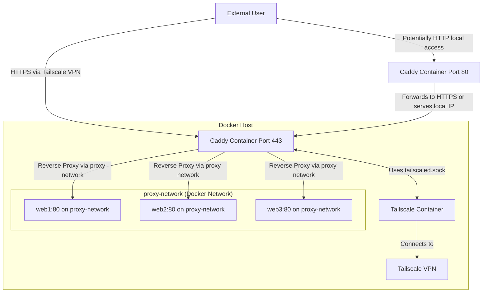

```mermaid
graph TD
    User[External User] -->|HTTPS via Tailscale VPN| CaddyService[Caddy Container Port 443]

    subgraph Docker Host
        CaddyService -->|Reverse Proxy via proxy-network| Web1[web1:80 on proxy-network]
        CaddyService -->|Reverse Proxy via proxy-network| Web2[web2:80 on proxy-network]
        CaddyService -->|Reverse Proxy via proxy-network| Web3[web3:80 on proxy-network]

        CaddyService <-->|Uses tailscaled.sock| TailscaleService[Tailscale Container]
        TailscaleService -->|Connects to| TailscaleVPN[Tailscale VPN]

        subgraph "proxy-network (Docker Network)"
            Web1
            Web2
            Web3
        end
    end

    User -->|Potentially HTTP local access| CaddyServicePort80[Caddy Container Port 80]
    CaddyServicePort80 -->|Forwards to HTTPS or serves local IP| CaddyService
```
