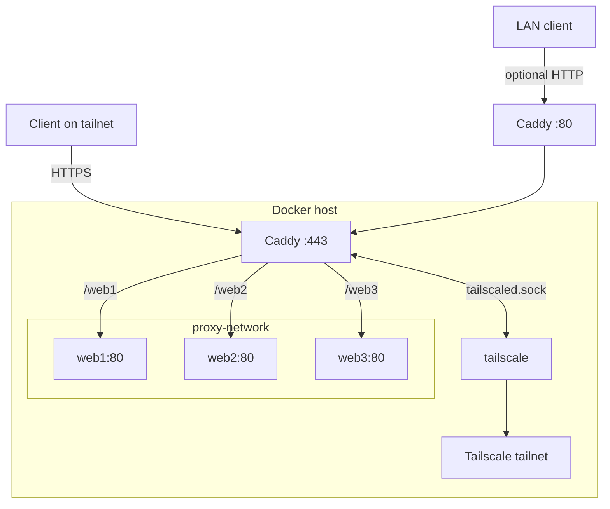

# Architecture

## Notes

- Caddy terminates HTTPS for the Tailscale `.ts.net` name.
- Caddy reaches backend services over `proxy-network`.
- Tailscale state is persisted under `./tailscale/varlib`.
- Caddy data and config are persisted under `./caddy`.
- The LAN HTTP block is optional and should match your local network.
